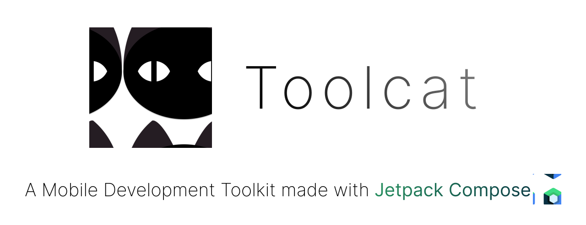

<div align="center">
  <a>
    
  </a>
</div>

Toolcat is a Development Toolkit for Mobile Applications for Android and iOS *(iOS very experimental)*

## Features

This is a feature list that I either have already implemented or planned. You are always welcome to write your suggestions in the [Issues](https://github.com/anthonyhfm/toolcat/issues) tab

**Android Development**:
- Basic
  - [x] Listing all connected Android Devices and Emulators
  - [x] Showing advanced device information
  - [ ] Connecting via wireless ADB
- Quick Actions
    - [x] Taking screenshots
    - [x] Navigation simulation
    - [ ] Coffeination
    - [ ] Sending deeplinks
- Others
  - [ ] Screen Mirroring
  - [ ] Installing, Downloading and Managing Apps
  - [ ] Layout Inspection
  - [ ] Monitoring Logcat

**iOS Support**
- Basic
  - [ ] Listing all connected iOS Devices and Simulators
  - ... More to come
- Others
  - [ ] Installing, Downloading and Managing Apps
  - [ ] Recovering Apple Devices with *.ipsw files
  - [ ] Screen Mirroring
  - ... More to come

## Platform specific platform support

|        | Android Devices | Android Emulators | iOS Devices              | iOS Simulators |
|--------| --------------- | ----------------- |--------------------------|----------------|
| Windows | Yes | Yes | No                       | No             |
| Linux  | Yes | Yes | Install libimobiledevice | No             |
| MacOS  | Yes | Yes | Install libimobiledevice | Yes            |

## How do I connect my device?

1. Enable developer mode on your phone
2. Connect your device via USB
3. Trust your computer if a dialog pops up

Done! You should be ready to go :)

## Build it yourself

This project is built with [Hydraulic Conveyor](https://www.hydraulic.dev/). 

Install the Conveyor [npm package](https://www.npmjs.com/package/@hydraulic/conveyor):

```shell
npm install -g @hydraulic/conveyor
```

After the installation is done, you can open the root directory of this project and run:
```shell
./gradlew build

conveyor make site
```

This should build executables for all platforms in the `/output` directory.

-----

Made with 💚 by [Anthony Hofmeister](https://github.com/anthonyhfm)